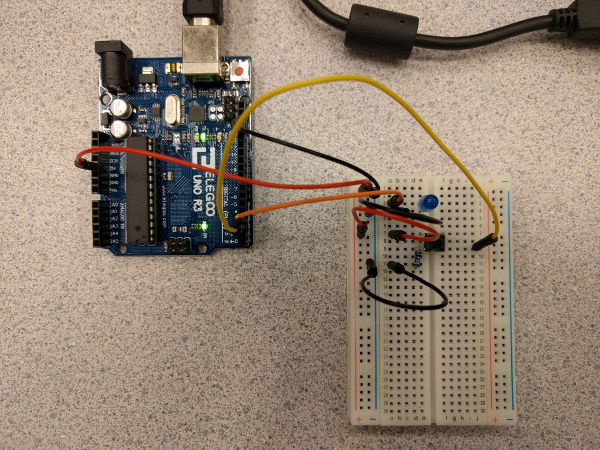
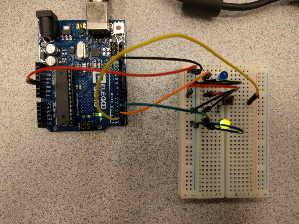
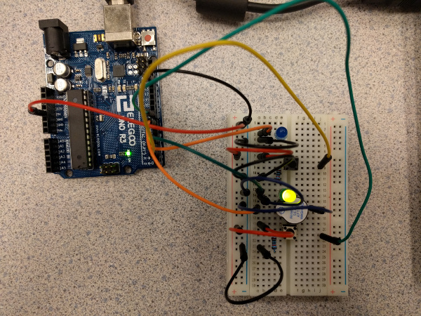
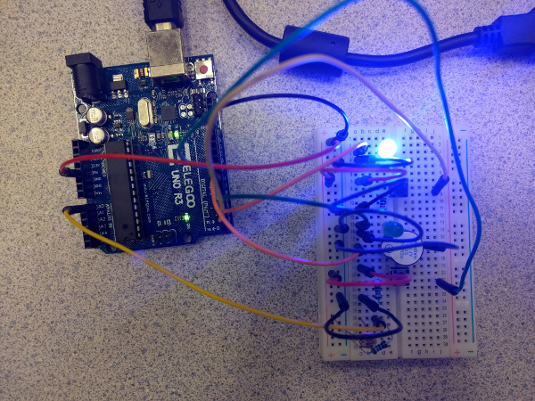

# Sensor Station

## What you need

    - Arduino or compatible microcontroller
    - Basic Starter Kit parts
    - Personal computer with Go installed, and a serial port.

## Installation

```
go get -d -u gobot.io/x/gobot/...
```

## Connecting the Arduino to your computer

Plug the Arduino into your computer using the USB cable provided in your starter kit. The Firmata firmware that we use for controlling the Arduino from your computer has already been flashed onto the Arduino board.

## Running the code

When you run any of these examples, you will compile and execute the code on your computer.

To compile and run the code:

```
$ go run sensor/step01/main.go /dev/ttyACM0
```

If using macOS then the Arduino will probably use a device name like `/dev/tty.usbmodem1421`. Perform a directory listing of `/dev/`; the Arduino is likely a device named using the pattern `/dev/tty.usbmodem`.

Substitute the name of the program and the name of your serial port as needed.

The Gobot program will use the serial interface to communicate with the connected Arduino that is running the Firmata firmware. Your Arduino already has Firmata installed for you. If you need to reload Firmata on your Arduino you can use Gort (http://gort.io)

## Code

### step0.go - Built-in LED


This tests that the Arduino is connected correctly to your computer, by blinking the built-in LED.

```
$ go run sensor/step0/main.go /dev/ttyACM0
```

### step1.go - Blue LED


First connect the power on the Arduino to the breadboard as follows:

- Connect the 5V power pin on the Arduino to the breadboard's red power rail (+) using a red jumper cable.

- Connect the GND pin on the Arduino to the breadboard's blue ground rail (-) using a black jumper cable.


- Plug a blue LED to pin 3 and pin 4 on the breadboard. Make sure the longer pin of the LED is plugged into pin 3. Any column on the breadboard (a-e) will work.

- Connect pin 3 on the Arduino to pin 3 on the breadboard. Choose any color of cable besides red or black.

- Connect pin 4 on the breadboard to the breadboard's blue ground rail (-) using a black jumper cable.

- Discover what tty is being used by your connection: `ls /dev/tty.*`

Run the code.

```
$ go run sensor/step1/main.go /dev/ttyACM0
```

You should see the blue LED blink.

### step2.go - Blue LED, Button



- Connect the button to the breadboard so one side connects to pins 7 and 9 on one side of the gap, and connects to pins 7 and 9 on the other side of the gap.

- Connect a red jumper cable from the power rail (+) on the breadboard to pin 7 on the breadboard.

- Connect a 10K Ohm resistor from pin 9 on the breadboard to pin 11 on the breadboard.

- Connect a black jumper cable from the ground rail (-) on the breadboard to pin 23 on the breadboard.

- Connect pin 8 on the Arduino to pin 9 on the breadboard on the opposite side. Choose any color of cable besides red or black.

Run the code.

```
$ go run sensor/step2/main.go /dev/ttyACM0
```

When you press the button, the blue LED should turn on.

### step3.go - Blue LED, Button, Green LED



- Plug a green LED to pin 13 and pin 14 on the breadboard. Make sure the longer pin of the LED is plugged into pin 13.

- Connect pin 4 on the Arduino to pin 13 on the breadboard. Choose any color of cable besides red or black.

- Connect pin 14 on the breadboard to the breadboard's blue ground rail (-) using a black jumper cable.

Run the code.

```
$ go run sensor/step3/main.go /dev/ttyACM0
```

The green LED should light up. When you press the button, the blue LED should turn on, and the green LED should turn off.

### step4.go - Blue LED, Button, Green LED, Gobot API

This step has us playing with the Gobot API. No additional hardware needs to be connected.

Run the code.

```
$ go run sensor/step3/main.go /dev/ttyACM0
```

You can now point your web browser to `http://localhost:3000` and try out the [Robeaux](https://github.com/hybridgroup/robeaux) web interface.

### step5.go - Blue LED, Button, Green LED, Gobot API, Buzzer, Additional Button



- Connect the buzzer to pin 16 on both sides of the breadboard. Make sure the plus (+) is on the left side.

- Connect pin 16 on the right side of the breadboard to the ground rail (-) on the breadboard.

- Connect pin 7 on the Arduino to pin 16 on the left side of the breadboard.

- Connect a second button to the breadboard so one side connects to pins 19 and 21 on one side of the gap, and connects to pins 19 and 21 on the other side of the gap.

- Connect a red jumper cable from the power rail (+) on the breadboard to pin 19 on the breadboard.

- Connect a 10K Ohm resistor from pin 21 on the breadboard to pin 23 on the breadboard.

- Connect a black jumper cable from the ground rail (-) on the breadboard to pin 23 on the breadboard.

- Connect pin 8 on the Arduino to pin 21 on the breadboard on the opposite side. Choose any color of cable besides red or black.

Run the code.

```
$ go run sensor/step5/main.go /dev/ttyACM0
```

When you press the second button, the buzzer should sound.

### step6.go - Blue LED, Button, Green LED, Cylon.js API, Buzzer, Additional Button, Photoresistor



- Connect the Photoresistor to pin 26 on the breadboard and the power rail (+) on the breadboard.

- Connect a 10K Ohm resistor from pin 26 on the breadboard to the ground rail (-) on the breadboard.

- Connect pin A0 on the Arduino to pin 26 on the breadboard. Choose any color of cable besides red or black.

Run the code.

```
$ go run sensor/step6/main.go /dev/ttyACM0
```

Changing the light level will display the current analog reading on your console.

## License

Copyright (c) 2015-2018 The Hybrid Group. Licensed under the MIT license.
