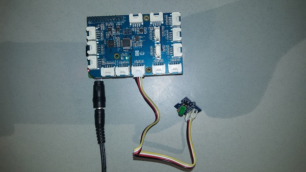
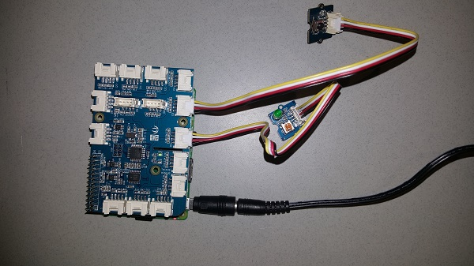
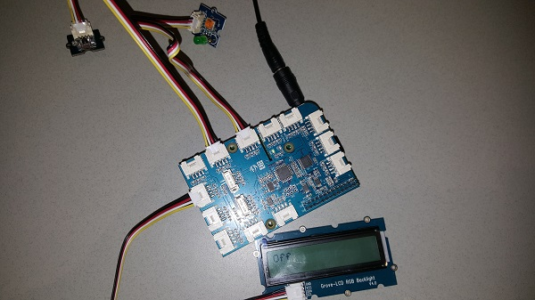
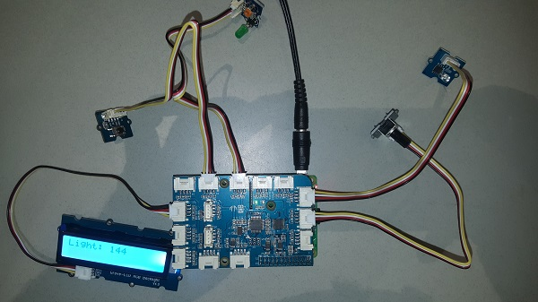

# Raspberry Pi Sensor Station

## What you need

    - Raspberry Pi running latest Raspbian OS
    - Grove IoT Starter Kit parts
    - Personal computer with Go 1.10+ installed

## Installation

```
go get -d -u gobot.io/x/gobot/...
```

## Running the code

When you run any of these examples, you will compile the code on your computer, but then execute the binary file on the Raspberry Pi itself. 

This will require moving the compiled code onto the Raspberry Pi, and then execute the code on the Raspberry Pi itself, not on your own computer.

We have included a shell script to make this process easier. On Linux or macOS, you can run it like this:

```
./runner.sh step1 192.168.1.42
```

On Windows, you can run it like this:

```
./runner.cmd step1 192.168.1.42
```

Note: You'll use the IP Address you get during the setup process

The `runner.sh` script performs the following steps for you:

For example, to compile the code for step 1:

```
GOARCH=arm GOOS=linux go build -o step1app step1/main.go
```

Then to move the code to the Raspberry Pi, it uses the `scp` command:

```
scp step1app pi@[IP of your device]:/home/pi/step1app
```

Lastly, to execute it on your Raspberry Pi, it uses the `ssh` command:

```
ssh -t pi@[IP of your device] ./step1app
```

Ready? Let's get started.

### step1.go - LED



Connect the green LED to pin D2 on the GrovePi+ board using the Grove connector.

Run the code:

```
$ ./runner.sh step1 192.168.1.42
```

You should see the LED blink.

### step2.go - LED, Button



Connect the Grove button to pin D3 on the GrovePi+ board using the Grove connector.

Run the code:

```
$ ./runner.sh step2 192.168.1.42
```

When you press the button, you should see the LED turn on. When you release the button, it should turn off.

### step3.go - LED, Button, RGB LCD Display



Connect the Grove RGB LCD to pin i2c-1 on the GrovePi+ board using the Grove connector.

Run the code:

```
$ ./runner.sh step3 192.168.1.42
```

Now when you press the button, in addition to the LED turning on, you should also RGB LCD display a message that the button has been pushed. When you release the button, the LED should turn off, and a different message displayed on the RGB LCD.

### step4.go - LED, Button, RGB LCD Display, Rotary


Connect the Grove Rotary dial to pin A1 on the GrovePi+ board using the Grove connector.

Run the code:

```
$ ./runner.sh step4 192.168.1.42
```

Now when you press the button, in addition to the LED turning on, you should also RGB LCD display a message that the button has been pushed. When you release the button, the LED should turn off, and a different message displayed on the RGB LCD.

### step5.go - LED, Button, RGB LCD Display, Rotary, Gobot API


In this step, you will try out the Gobot API. No additional hardware is added.

Run the code:

```
$ ./runner.sh step5 192.168.1.42
```

### step6.go - LED, Button, RGB LCD Display, Rotary, Gobot API, Light Sensor



Connect the Grove Light sensor to pin A2 on the GrovePi+ board using the Grove connector.

Run the code:

```
$ ./runner.sh step6 192.168.1.42
```

When the light level changes, you should see a message on the RGB LCD display.
